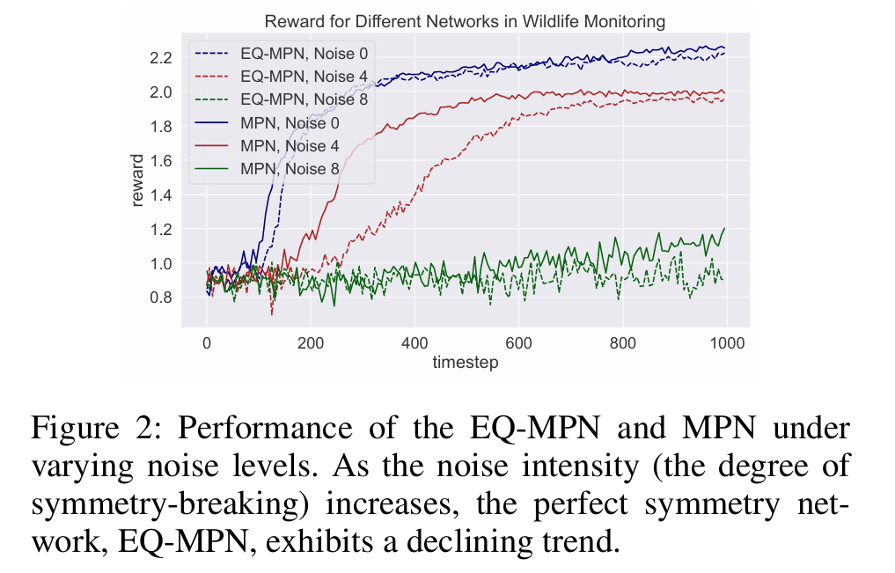
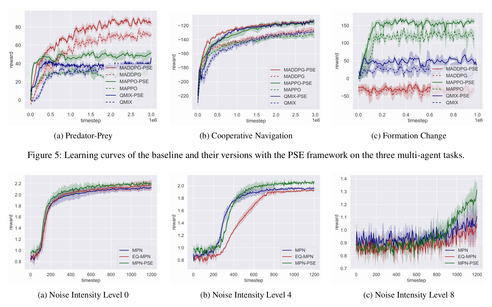
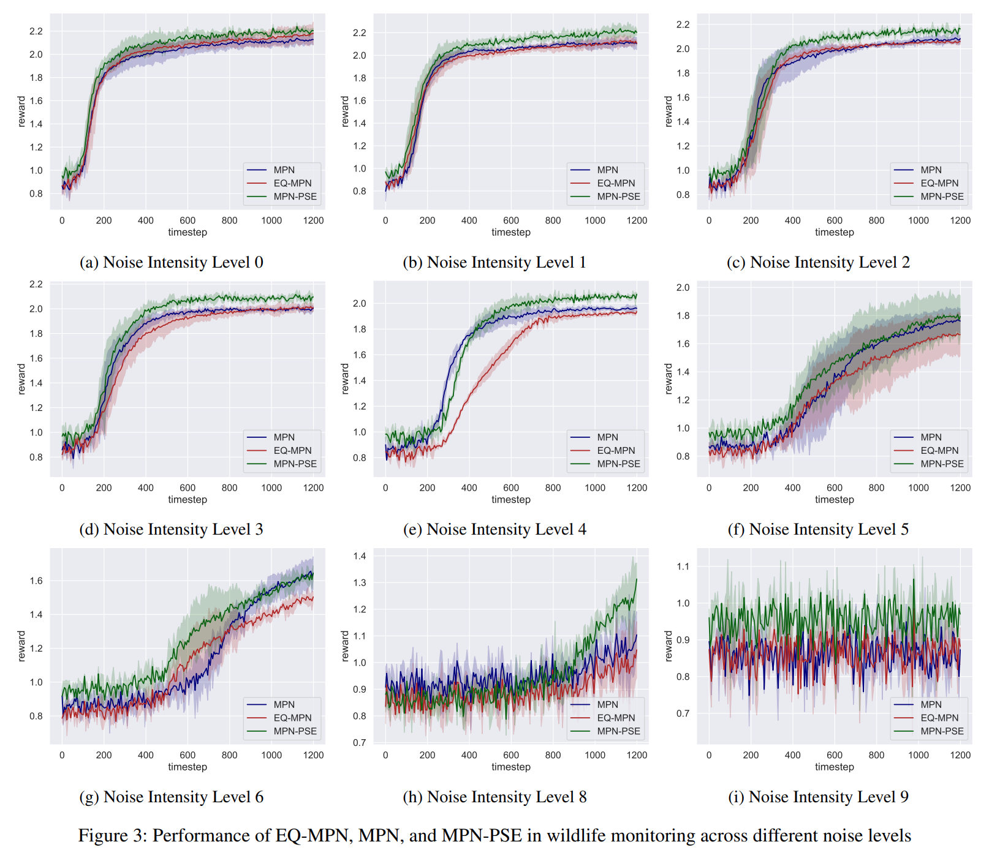
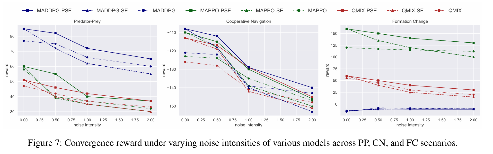
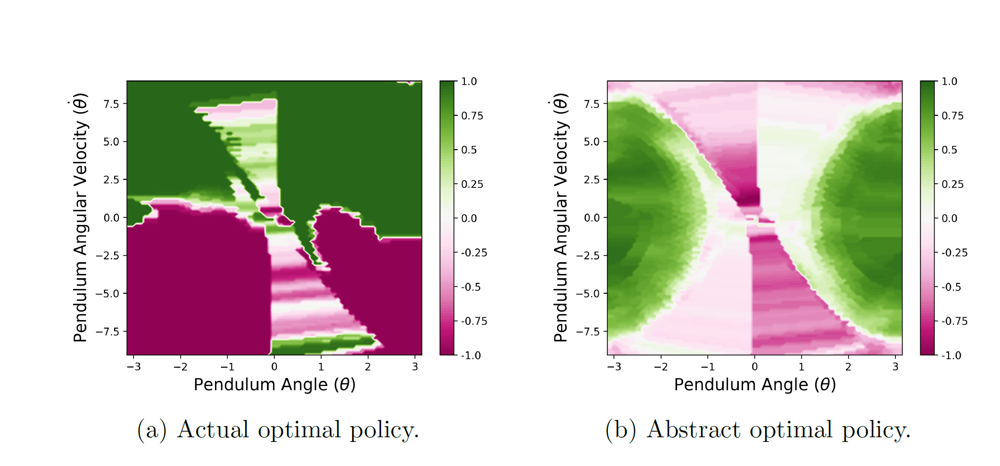

# 开头的引入实验

# 主实验：星际争霸、群体运动

# 在不同噪声下的实验

# 消融后的实验

# 可视化的例子

# 根据本文需要补充的实验方案

## 实验总目标

本文的实验不只是证明某个网络结构性能更高，而是要证明“模糊对称性”作为连续、局部、可解释的结构属性，确实能帮助 MARL 在非完美对称环境中更稳健地利用对称先验。因此实验需要围绕以下几个问题展开：

1. 模糊对称性感知框架是否能在存在对称破坏的 MARL 任务中提升最终性能和样本效率？
2. 相比严格等变模型，本文方法是否能在对称性逐渐被破坏时退化更平缓？
3. 相比数据增强或固定一致性正则，本文方法是否能更有效地按隶属度利用对称信息？
4. 模糊隶属度是否真的学到或计算出了“哪里更对称、哪里更不对称”的结构规律？
5. 对称结构主干、非对称补偿分支、模糊加权融合和模糊一致性正则分别贡献了什么？

## 实验一：引入实验，说明为什么需要模糊对称

**目的：** 用一个简单、可控、可视化强的环境说明：真实任务中的对称性往往不是严格成立，而是随着扰动强度连续变化。这个实验应该放在主实验之前，作为论文 motivation 的实验证据。

**推荐环境：**

- 单智能体或双智能体的 pendulum / navigation toy environment。
- 环境本身具有旋转、镜像或智能体置换对称性。
- 人为加入风场、局部障碍、传感噪声、动力学偏置等扰动，形成从完美对称到严重破坏的连续变化。

**具体设置：**

- 设定对称破坏强度 $\sigma \in \{0, 0.1, 0.2, 0.4, 0.6, 0.8, 1.0\}$。
- 对每个状态-动作对计算奖励偏差 $\Delta_r(s,a;g)$、转移偏差 $\Delta_p(s,a;g)$ 和模糊隶属度 $\mu(s,a;g)$。
- 可视化真实最优策略、对称变换后的策略、模糊隶属度热力图。

**需要展示的图：**

- 图 1：不同 $\sigma$ 下的策略性能曲线。
- 图 2：状态空间中的模糊隶属度热力图。
- 图 3：严格等变模型在低噪声下表现好，但在高噪声下失败；本文方法随着隶属度降低自动增加残差补偿。

**预期结论：** 当 $\sigma$ 较小时，对称先验是有益的；当 $\sigma$ 增大时，强制等变会引入错误偏置；本文方法通过模糊隶属度连续调节结构先验，可以在两者之间取得平衡。

## 实验二：主实验，验证总体性能和样本效率

**目的：** 在标准 MARL benchmark 上证明本文方法能够提升学习效率、最终回报和泛化性能。

**推荐任务：**

1. Predator-Prey：验证智能体置换对称和局部动力学扰动下的鲁棒性。
2. Cooperative Navigation：验证协作导航中位置变换、智能体交换和感知噪声下的性能。
3. Formation Change：验证队形控制中旋转、平移、局部障碍和异构执行误差下的性能。
4. StarCraft Multi-Agent Challenge 或简化星际争霸任务：作为复杂高维任务，验证方法是否能迁移到更真实的 MARL 场景。

**对称破坏方式：**

- 非均匀感知噪声：不同智能体的观测噪声强度不同。
- 非均匀执行噪声：不同智能体动作执行存在不同偏差。
- 局部环境扰动：加入非对称障碍物、风场或地形阻力。
- 奖励扰动：对部分区域或部分智能体加入额外代价，使奖励不再严格对称。
- 任务异构性：让部分智能体速度、视野、攻击范围或动力学参数略有不同。

**评价指标：**

- Final return：训练末期平均回报。
- Sample efficiency：达到指定回报阈值所需 timestep。
- Robustness slope：性能随 $\sigma$ 增大而下降的斜率，越平缓越好。
- Generalization return：在未见过的扰动强度、智能体数量或地图布局上的回报。
- Success rate：导航、追捕、队形保持等任务的成功率。

**建议结果形式：**

- 主表：不同任务上的最终性能，报告 mean ± std。
- 学习曲线：每个任务画训练回报曲线。
- 鲁棒性曲线：横轴为 $\sigma$，纵轴为最终回报或成功率。
- 样本效率表：达到 80% 最佳回报所需环境交互步数。

## 实验三：对比方法设计

为了说服审稿人，baseline 需要覆盖“无对称”“严格对称”“软利用对称”“残差软等变”“本文模糊对称”这几个层次。

**基础 MARL baseline：**

- MAPPO / IPPO：无显式对称结构。
- QMIX / VDN：适合值分解任务时使用。
- MADDPG：连续控制或混合协作任务中可作为经典 baseline。

**对称性感知 baseline：**

- Equivariant MARL：严格等变或置换等变结构，不加残差补偿。
- Data Augmentation：对状态、动作或轨迹做对称变换增强。
- Consistency Regularization：对原样本和变换样本加入一致性损失。
- Partial Symmetry / ESP 类方法：若实现可用，应作为最直接对比。
- Residual Pathway without Fuzzy：有等变分支和残差分支，但使用固定融合系数。

**本文方法：**

- Fuzzy-Symmetry MARL：完整模型，包括对称结构主干、非对称补偿分支、模糊隶属度加权融合和模糊一致性正则。

**关键比较逻辑：**

- 与普通 MARL 比：证明结构先验有价值。
- 与严格等变比：证明非完美对称下不能强制使用硬约束。
- 与数据增强比：证明本文不是简单增加样本，而是在表示层面自适应利用对称性。
- 与固定残差融合比：证明模糊隶属度的局部自适应调节是必要的。

## 实验四：对称破坏强度扫描

**目的：** 这是本文最核心的鲁棒性实验，用来直接支撑“模糊对称适合非完美对称”的主张。

**设置：**

- 在每个环境中设置多个对称破坏强度 $\sigma$。
- 推荐使用 $\sigma \in \{0, 0.1, 0.2, 0.4, 0.6, 0.8, 1.0\}$。
- 每个 $\sigma$ 至少运行 5 个随机种子。
- 训练扰动和测试扰动可以分开设置，测试时加入训练中未见过的 $\sigma$。

**需要观察的现象：**

- $\sigma=0$ 或很小时，严格等变模型通常很强，本文方法应该接近或略优。
- 中等 $\sigma$ 时，严格等变模型开始受错误结构先验影响，本文方法应明显占优。
- 大 $\sigma$ 时，无结构模型可能更稳定，但样本效率低；本文方法应通过残差分支保持竞争力。
- 本文方法的性能下降曲线应比严格等变和固定融合方法更平缓。

**推荐图：**

- 横轴为 $\sigma$，纵轴为 final return。
- 同一图中比较 MAPPO、Equivariant MAPPO、Residual w/o Fuzzy、Augmentation、Ours。
- 可以额外画 normalized performance drop：$\frac{J(0)-J(\sigma)}{J(0)}$。

## 实验五：消融实验

**目的：** 分离验证每个设计模块的必要性。

**建议消融版本：**

1. Full model：完整模糊对称框架。
2. w/o residual：去掉非对称补偿分支，只保留对称结构主干。
3. w/o symmetry branch：去掉对称结构主干，只保留普通 MARL 表示。
4. w/o fuzzy gate：用固定系数 $\lambda$ 融合对称分支和残差分支。
5. hard gate：把模糊隶属度阈值化，高于阈值走对称分支，低于阈值走残差分支。
6. w/o fuzzy consistency：保留模糊融合，但去掉隶属度加权一致性正则。
7. learned gate only：使用普通 MLP gate，不显式使用 $\Delta_r$、$\Delta_p$ 或 $\mu(s,a;g)$。
8. random membership：使用随机或打乱后的隶属度，检验隶属度语义是否重要。

**每个消融对应的论文 claim：**

- w/o residual：验证残差分支是否能吸收对称破坏。
- w/o fuzzy gate：验证连续隶属度调节是否优于固定软等变。
- hard gate：验证模糊软决策是否优于二值切换。
- w/o fuzzy consistency：验证优化层面的模糊正则是否有贡献。
- learned gate only：验证本文的隶属度不是普通黑箱注意力，而是与对称偏差相关的结构量。
- random membership：验证性能提升来自正确的模糊对称估计，而不是额外参数。

## 实验六：模糊隶属度和分支权重的可解释性分析

**目的：** 这部分对 TFS 很关键。它需要说明模糊逻辑不是附加包装，而是模型做结构决策的核心机制。

**分析内容：**

1. 隶属度与扰动强度的关系：随着 $\sigma$ 增大，平均 $\mu$ 应下降。
2. 隶属度与局部环境的关系：在障碍物附近、强风区域、异构智能体附近，$\mu$ 应更低。
3. 分支激活关系：高 $\mu$ 状态更多依赖对称结构主干，低 $\mu$ 状态更多激活残差分支。
4. 隶属度与性能风险的关系：低 $\mu$ 区域中强制等变模型更容易产生错误动作。
5. 训练动态：训练早期和后期的 $\mu$ 分布、残差分支权重、模糊一致性损失变化。

**推荐图：**

- $\sigma$-$\mu$ 曲线：横轴扰动强度，纵轴平均模糊隶属度。
- heatmap：在二维导航或摆杆状态空间中显示 $\mu(s,a;g)$。
- scatter plot：横轴 $\mu$，纵轴等变分支权重或残差分支权重。
- case study：展示几个高隶属度和低隶属度状态下模型动作差异。

**预期结论：** 模糊隶属度能够反映局部对称可靠性，并驱动模型在对称归纳偏置和非对称补偿之间自适应切换。

## 实验七：泛化实验

**目的：** 验证本文方法学到的不是某个固定扰动强度下的策略，而是能泛化到新的对称破坏模式。

**推荐设置：**

- 训练时使用 $\sigma \in \{0, 0.2, 0.4\}$，测试时使用 $\sigma \in \{0.1, 0.3, 0.6, 0.8\}$。
- 训练时使用固定智能体数量，测试时改变智能体数量。
- 训练时使用一种障碍布局，测试时使用新的障碍布局。
- 训练时使用同质智能体，测试时加入轻微异构动力学。

**评价指标：**

- unseen-$\sigma$ final return。
- unseen-map success rate。
- cross-agent-number generalization。
- zero-shot 或 few-shot adaptation performance。

**预期结论：** 由于本文方法不是把某个固定对称假设硬编码到底，而是根据隶属度决定使用强度，因此在未见扰动和异构场景中应具有更好的泛化。

## 实验八：真实或半真实系统验证

如果时间允许，建议加入一个真实机器人或高保真仿真实验。这个实验不一定要很大，但会显著增强 TFS 投稿说服力。

**可选场景：**

- 多机器人协同导航。
- 多无人车队形保持。
- 多无人机编队或追踪。
- 真实机器人 + 仿真扰动混合测试。

**对称破坏来源：**

- 机器人动力学差异。
- 电机执行误差。
- 传感器噪声。
- 地面摩擦差异。
- 局部通信延迟或丢包。

**需要证明：**

- 真实系统中对称性确实不是严格成立。
- 本文方法能根据局部对称可靠性调整结构先验。
- 在真实扰动下，本文方法比严格等变或固定融合方法更稳。

## 最终论文中的图表安排建议

**主文建议保留 5-6 个核心图表：**

1. 方法示意图：模糊隶属度如何调节对称分支、残差分支和一致性正则。
2. 主结果表：多个任务上的 final return / success rate。
3. 学习曲线图：展示样本效率。
4. 对称破坏强度扫描图：展示鲁棒性。
5. 消融表：展示各模块贡献。
6. 可解释性图：展示 $\mu$ heatmap 或分支权重变化。

**附录可以放：**

- 更多环境细节。
- 所有超参数。
- 更多随机种子结果。
- 更多 $\sigma$ 水平下的曲线。
- 真实系统或额外地图的补充视频截图。

## 实验优先级

如果时间有限，建议按下面顺序推进：

1. 先做对称破坏强度扫描，这是本文最关键证据。
2. 再做主 benchmark 对比，证明总体性能。
3. 再做消融，证明模糊门控和残差分支确实必要。
4. 再做可解释性分析，增强 TFS 论文定位。
5. 最后补泛化和真实系统实验，提高论文上限。

## Claim-Evidence 对齐表

| 论文主张 | 需要的实验支撑 | 证据形式 |
| --- | --- | --- |
| 模糊对称能提升非完美对称环境下的 MARL 性能 | 主 benchmark 对比 | final return、success rate、学习曲线 |
| 连续隶属度优于严格等变或固定融合 | 对称破坏强度扫描 | $\sigma$-performance 曲线 |
| 残差分支能补偿对称破坏 | w/o residual 消融 | 中高 $\sigma$ 下性能下降 |
| 模糊门控不是普通黑箱 gate | learned gate / random membership 消融 | 性能差异和 $\mu$ 相关性 |
| 模糊机制具有可解释性 | 隶属度 heatmap 和分支权重分析 | $\mu$ 与扰动区域、残差激活相关 |
| 方法具有泛化能力 | unseen $\sigma$、unseen map、不同智能体数量测试 | zero-shot / generalization return |
